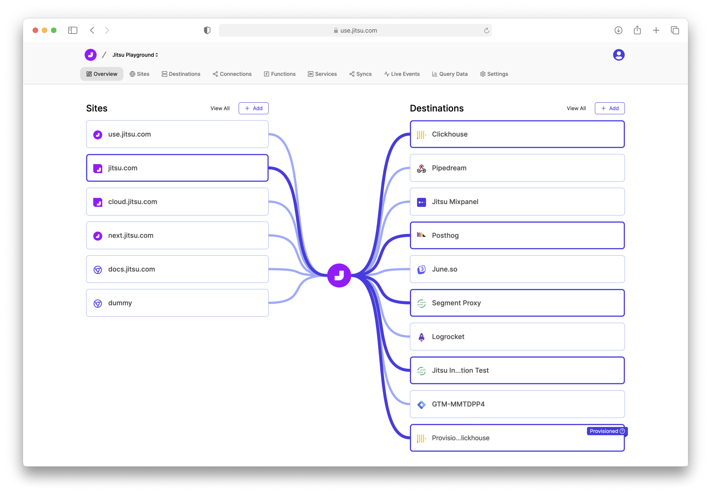

# Jitsu CI/CD pipeline

Deploy Jitsu server with CI/CD on Elestio

 
 

# First Use

Jitsu self-hosted authorization is based on GitHub OAuth.

You'll need to create a GitHub OAuth application to get those values:

- Go to Github Developer settings » OAuth Apps » New OAuth App.
- Put any value to Application name
- Set Homepage URL and Authorization callback URL with value of [CI_CD_DOMAIN]
- Press Register application button
- Press Generate a new client secret button
- Update the env vars to indicate your credentials

      Open Elestio dashboard > Service overview > click on UPDATE CONFIG button > Env tab

- Copy Client ID and Client Secret values to GITHUB_CLIENT_ID and GITHUB_CLIENT_SECRET variables respectively.
- Click on Update & Restart

# Once deployed ...

You can open Jitsu UI here:

    URL: https://[CI_CD_DOMAIN]

You can open PgAdmin web UI here:

    URL: https://[CI_CD_DOMAIN]:25538
    email: [ADMIN_EMAIL]
    password: [ADMIN_PASSWORD]

# syncctl

To use syncctl, you'll have to copy your `kubeconfig` file from your kubernetes instance and paste it in the root of your Jitsu project.
Then, uncomment in the docker-compose.yml file

    SYNCCTL_KUBERNETES_CLIENT_CONFIG: "/kubeconfig"
    - ./kubeconfig:/kubeconfig

then, run the following command:

    docker-compose down
    docker-compose up -d
